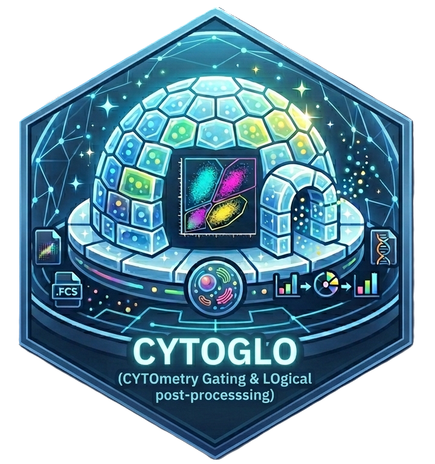

<!-- README.md is generated from README.Rmd. Please edit that file -->

```{r, include = FALSE}
  knitr::opts_chunk$set(
    collapse = TRUE,
    comment = "#>",
    fig.path = "man/figures/README-",
    out.width = "100%"
)
```


# CYTOGLO 

CYTOGLO (CYTOmetry Gating & LOgical post-processsing) is a novel shiny app for the elaboration of the CytOF files. From the raw .fcs files is it possibile to apply a PeacoQC filtering, a customized gating and include panel files and metadata files in order to create a final SingleCellExperiment object. From this object you can perform clustering, dimensionality reduction and differential expression analysis.

<!-- badges: start -->
[](https://lifecycle.r-lib.org/articles/stages.html#stable)
[](https://github.com/ShinyFabio/CYTOGLO/actions/workflows/R-CMD-check.yaml)
<!-- badges: end -->

## Installation

You can install the development version of `{CYTOGLO}` like so:

```{r}
devtools::install_github("ShinyFabio/CYTOGLO")
```

## Run

You can launch the application by running:

```{r, eval = FALSE}
CYTOGLO::run_app()
```


